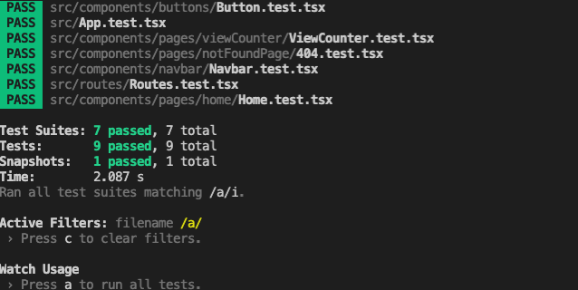

----
###  What is this app for?
##### A simple application for incrementing a number and showing the result on another page.
##### Live url: http://139.59.142.175:3000/
----

###  Which stack has been used for this project?

#### React, Typescript, Redux, Scss, Jest and Git
#### Hosting on  digitalocean http://139.59.142.175:3000/
------

### The structure of the project 
#### From the root in the src  folder you can find:
##### 1. components,    ==> Every component has its style, interface, test separately 
##### 2. sharedStyles,  ==> Here is where all global variables for the scss files
##### 3. routes,        ==> Defines every single  route that has been used in this project
##### 4. stateManagment ==> The core of the application which holds the data for the entire application

------

### Which improvments has been done on this project that has not been in the requirements?
###### 1. Using scss instead of css
###### 2. Adding jest test
###### 3. Hosting on digital ocean
------

### How to run the dev envirument? 
###### 1. make sure you have latest node and npm package installed
###### 2. clone the project or unzipe the zipped files
###### 3. npm install in the terminal from the root folder (for loading all dependencies)
###### 4. npm start
###### 5. The page should be open at: [http://localhost:3000] *OBG*(Please make sure port 3000 is free when you run this project)

------
### How to run jest test? *OBG* (Make sure the application is running before you start testing.)
###### 1. go to root foler
###### 2. npm install
###### 3. open another terminal and run `npm test` you should scroll up and see the result like this
###### 

------
### How to run build
##### 1. make sure you run this project once before you want to run build
##### 2. npm run build
